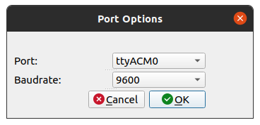
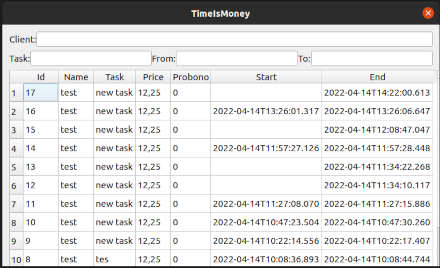
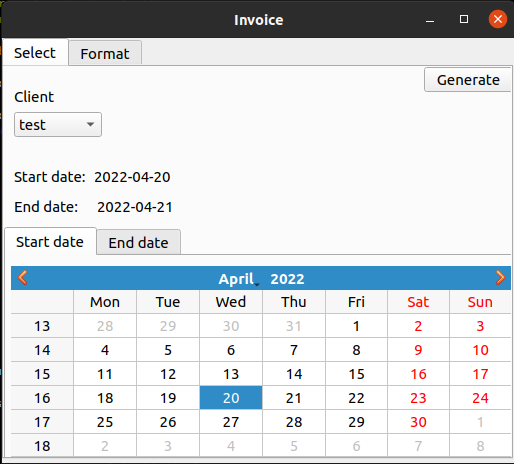
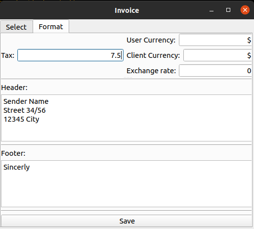
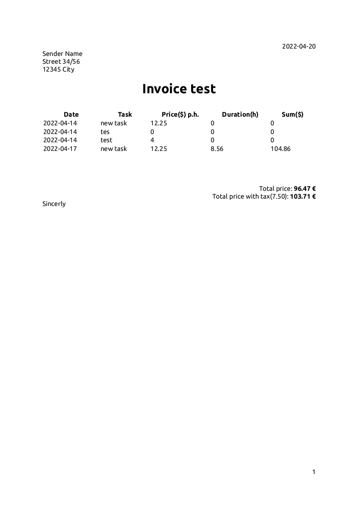

## 1.0.1
- remove placeholder from init design
- QSerialPort/QSerialPortInfo instead of plain serial reading
- serial reading via SIGNALS/SLOTS
- own class(QWidget) for Port settings

- progressbar to visualize running task

- when using a serial device you need to press stop 3 times to avoid accidental stopping

## 1.0.0
- add task overview with filtering

- create an invoice pdf

- add start/stop button with shortcuts (Alt+s/Alt+e)
- add installer files

## Init
- base functionality