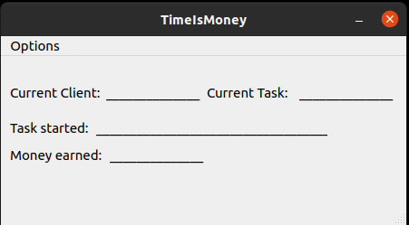
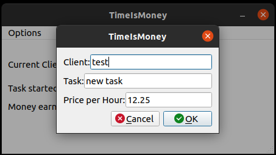
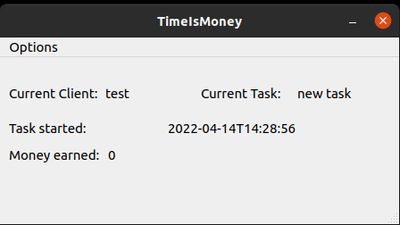

# QT-TimeIsMoney
A desktop version of [PFython/time_is_money](https://github.com/PFython/time_is_money) with support for a STM32-F401RE

- With a STM32-F401RE and two Buttons you would be able to Start/Stop the time recording for a specific Task for a specific Client.
- When starting a new Task the create view will be prefilled so that you only need the hit enter to start this Task.

 

